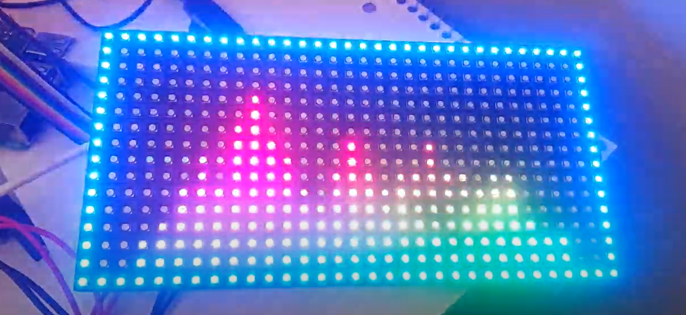

# Audio Visualizer
This repo showcases the audio visualizer my team and I developed during my senior of college (2020). The visualizer was built using a Raspberry Pi 3, stereo sound card, RGB matrix panel and programmed with python. The purpose of this project was to develop a dynamic and entertaining display that reacts to the sound of music.

## Functions
 * Radiant RGB coloring schemes
 * Eye-catching motions that intensify musical sounds
 * Percussion beat detection
 * Frequency amplitude and wave differentiation
 * Entertaining LED display that reacts to music

## Demo

Link to video: https://drive.google.com/file/d/1fsmA2Gfca2DYqzSSTPxvX0mmUtKfPTc0/view?usp=sharing
